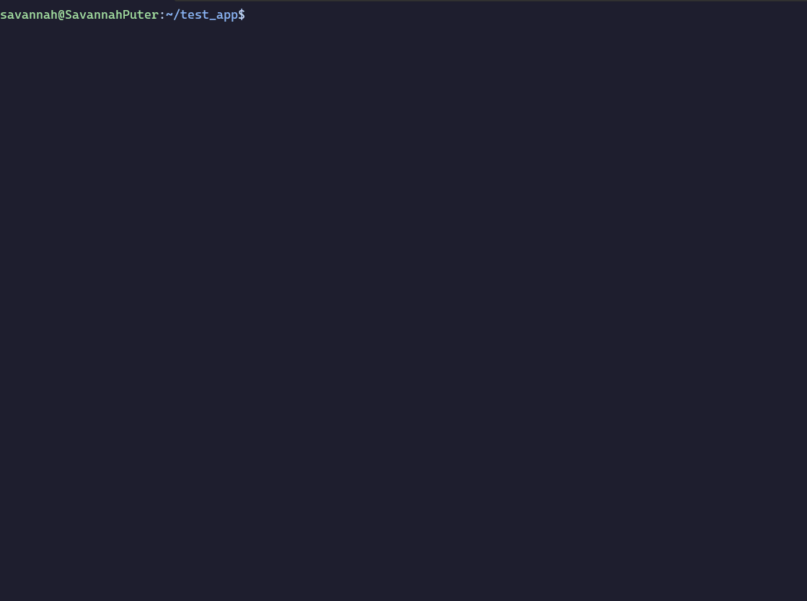

# Ghost 👻

Ghost is an experimental CLI that intelligently scaffolds a GitHub Action workflow based on your local application stack and natural language, using OpenAI.

## Getting started
1. First, you'll need to set up an [OpenAI API key](https://platform.openai.com/account/api-keys).
2. Run `ghost config set OPENAI_API_KEY <your key here>` with your key from step 1
3. Run `ghost run` to start project analysis of the current working directory.

If you have access to GPT-4, you can configure it as the model you use via `ghost config set ENABLE_GPT_4 true`.

## Installation
You can install the appropriate binary for your operating system by visiting the [Releases page](https://github.com/savannahostrowski/ghost/releases).

## Contributing
Contributions are welcome! To get started, check out the [contributing guidelines](CONTRIBUTING.md).

### Contributors

<!-- ALL-CONTRIBUTORS-LIST:START - Do not remove or modify this section -->
<!-- prettier-ignore-start -->
<!-- markdownlint-disable -->

<!-- markdownlint-restore -->
<!-- prettier-ignore-end -->

<!-- ALL-CONTRIBUTORS-LIST:END -->

## Libraries
Ghost uses:
- [Bubble Tea](https://github.com/charmbracelet/bubbletea)
- [Bubbles](https://github.com/charmbracelet/bubbles)
- [Lip Gloss](https://github.com/charmbracelet/lipgloss)
- [Log](https://github.com/charmbracelet/log)
- [Cobra](https://github.com/spf13/cobra)
- [Viper](https://github.com/spf13/viper)
